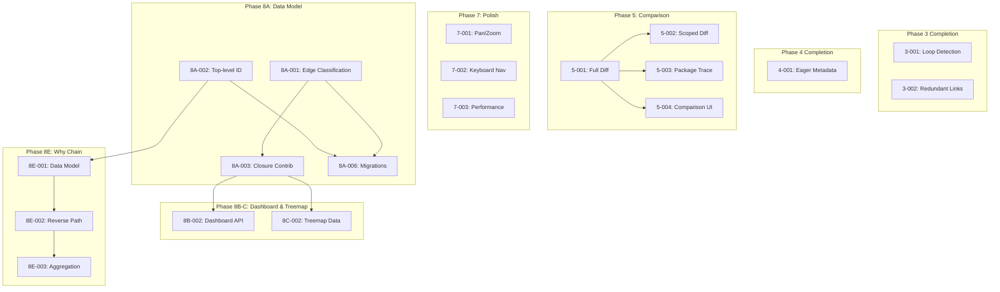

# Vizzy Visualization Improvement Project

## Project Overview

**Objective**: Complete remaining Vizzy phases and transform it from a graph topology viewer into a question-driven exploration tool for NixOS derivation analysis.

**Start Date**: 2024-01-XX  
**Target Completion**: 2024-03-XX  
**Project Lead**: TBD

---

## Executive Summary

| Metric | Value |
|--------|-------|
| Total Tasks | 51 |
| Completed | 51 |
| In Progress | 0 |
| Blocked | 0 |
| Not Started | 0 |

*Note: Task 8H-002 (Implement cross-view state coordination) completed on 2025-12-31*

### Phase Progress (Aligned with PRD.md)

```
Phase 1: Foundation           [██████████] 100% ✅
Phase 2: Core Visualization   [██████████] 100% ✅
Phase 3: Search & Analysis    [██████████] 100% ✅
Phase 4: NixOS Integration    [██████████] 100% ✅
Phase 5: Host Comparison      [██████████] 100% ✅
Phase 6: Additional Viz       [██████████] 100% ✅
Phase 7: Polish               [██████████] 100% ✅
Phase 8: Question-Driven Viz  [██████████] 100% ✅
```

---

## Phase 3: Search & Analysis (COMPLETE REMAINING)

### Status: 80% Complete

**Completed items:**
- ✅ Full-text search with trigram matching
- ✅ Path finding between nodes
- ✅ Duplicate package detection
- ✅ Sankey visualization for variants

**Remaining items:**

| Task ID | Task Name | Status | Assignee | Blocked By | Priority |
|---------|-----------|--------|----------|------------|----------|
| 3-001 | Implement loop detection (Tarjan's SCC) | COMPLETE | - | - | P1 |
| 3-002 | Implement redundant link detection | COMPLETE | - | - | P1 |

---

## Phase 4: NixOS Integration (COMPLETE REMAINING)

### Status: 90% Complete

**Completed items:**
- ✅ Flake discovery and parsing
- ✅ Host/module selection UI
- ✅ On-demand graph export from nix
- ✅ System packages enumeration
- ✅ Module-added packages view

**Remaining items:**

| Task ID | Task Name | Status | Assignee | Blocked By | Priority |
|---------|-----------|--------|----------|------------|----------|
| 4-001 | Implement eager metadata fetching at import | COMPLETED | - | - | P1 |

---

## Phase 5: Host Comparison (FROM PRD)

### Status: 100% Complete (4/4 tasks)

**Objective**: Compare two hosts/configurations side-by-side at multiple levels.

| Task ID | Task Name | Status | Assignee | Blocked By | Priority |
|---------|-----------|--------|----------|------------|----------|
| 5-001 | Implement full diff between two hosts | COMPLETED | - | - | P0 |
| 5-002 | Implement scoped diff (by package type/subsystem) | COMPLETED | - | 5-001 | P1 |
| 5-003 | Implement package trace comparison | COMPLETED | - | 5-001 | P1 |
| 5-004 | Build comparison UI | COMPLETED | - | 5-001 | P0 |

---

## Phase 7: Polish (FROM PRD)

### Status: 100% Complete (4/4 tasks)

**Objective**: Refine UX, add keyboard navigation, optimize performance.

| Task ID | Task Name | Status | Assignee | Blocked By | Priority |
|---------|-----------|--------|----------|------------|----------|
| 7-001 | Implement pan/zoom for large Graphviz graphs | COMPLETED | - | - | P1 |
| 7-002 | Add keyboard navigation | COMPLETED | - | - | P1 |
| 7-003 | Performance optimization | COMPLETED | - | - | P1 |
| 7-004 | URL state management improvements | COMPLETED | - | - | P2 |

---

## Phase 8: Question-Driven Visualizations (NEW)

### Status: Not Started

**Objective**: Transform Vizzy from showing graph topology to answering specific user questions about their NixOS configurations.

### 8A: Data Model Enhancements

| Task ID | Task Name | Status | Assignee | Blocked By | Priority |
|---------|-----------|--------|----------|------------|----------|
| 8A-001 | Add build-time vs runtime edge classification | COMPLETED | - | - | P0 |
| 8A-002 | Implement top-level package identification | COMPLETED | - | - | P0 |
| 8A-003 | Add closure contribution calculation | COMPLETED | - | 8A-001 | P0 |
| 8A-004 | Create baseline closure reference system | COMPLETED | - | - | P1 |
| 8A-005 | Enhance module attribution from nix CLI | COMPLETED | - | - | P1 |
| 8A-006 | Add database migrations for new fields | COMPLETED | - | 8A-001, 8A-002 | P0 |
| 8A-007 | Create data validation and integrity checks | COMPLETED | - | 8A-006 | P1 |
| 8A-008 | Implement incremental recomputation service | COMPLETED | - | 8A-003 | P2 |

### 8B: System Health Dashboard

| Task ID | Task Name | Status | Assignee | Blocked By | Priority |
|---------|-----------|--------|----------|------------|----------|
| 8B-001 | Design System Health Dashboard layout | COMPLETED | - | - | P0 |
| 8B-002 | Implement dashboard metrics API endpoints | COMPLETED | - | 8A-003 | P0 |
| 8B-003 | Build dashboard frontend component | COMPLETED | - | 8B-001, 8B-002 | P0 |

### 8C: Closure Treemap

| Task ID | Task Name | Status | Assignee | Blocked By | Priority |
|---------|-----------|--------|----------|------------|----------|
| 8C-001 | Design Closure Treemap component | COMPLETED | - | - | P0 |
| 8C-002 | Implement treemap data aggregation service | COMPLETED | - | 8A-003 | P0 |
| 8C-003 | Build interactive treemap with D3.js | COMPLETED | - | 8C-001, 8C-002 | P0 |
| 8C-004 | Add treemap zoom and filter interactions | COMPLETED | - | 8C-003 | P1 |

### 8D: Variant Matrix

| Task ID | Task Name | Status | Assignee | Blocked By | Priority |
|---------|-----------|--------|----------|------------|----------|
| 8D-001 | Design Variant Matrix layout | COMPLETED | - | - | P1 |
| 8D-002 | Implement variant matrix data service | COMPLETED | - | 8A-001 | P1 |
| 8D-003 | Build variant matrix frontend component | COMPLETED | - | 8D-001, 8D-002 | P1 |
| 8D-004 | Add matrix sorting and filtering | COMPLETED | - | 8D-003 | P2 |

### 8E: Why Chain (Attribution System)

| Task ID | Task Name | Status | Assignee | Blocked By | Priority |
|---------|-----------|--------|----------|------------|----------|
| 8E-001 | Design Why Chain data model | COMPLETED | - | 8A-002 | P0 |
| 8E-002 | Implement reverse path computation | COMPLETED | - | 8E-001 | P0 |
| 8E-003 | Build path aggregation algorithm | COMPLETED | - | 8E-002 | P0 |
| 8E-004 | Design Why Chain UI component | COMPLETED | - | - | P0 |
| 8E-005 | Implement Why Chain API endpoint | COMPLETED | - | 8E-003 | P0 |
| 8E-006 | Build Why Chain frontend visualization | COMPLETED | - | 8E-004, 8E-005 | P0 |
| 8E-007 | Add "essential vs removable" classification | COMPLETED | - | 8E-003 | P1 |
| 8E-008 | Implement attribution caching | COMPLETED | - | 8E-002 | P1 |
| 8E-009 | Add module-level attribution display | COMPLETED | - | 8A-005, 8E-006 | P2 |
| 8E-010 | Create attribution export functionality | COMPLETED | - | 8E-006 | P2 |

### 8F: Enhanced Comparison (extends Phase 5)

| Task ID | Task Name | Status | Assignee | Blocked By | Priority |
|---------|-----------|--------|----------|------------|----------|
| 8F-001 | Add semantic diff grouping | COMPLETED | - | 5-001 | P1 |
| 8F-002 | Implement version difference detection | COMPLETED | - | 5-001 | P1 |
| 8F-003 | Create comparison report export | COMPLETED | - | 5-004 | P2 |
| 8F-004 | Add baseline comparison presets | COMPLETED | - | 8A-004, 5-004 | P2 |

### 8G: Visual Explorer Improvements

| Task ID | Task Name | Status | Assignee | Blocked By | Priority |
|---------|-----------|--------|----------|------------|----------|
| 8G-001 | Implement semantic zoom for graph explorer | COMPLETED | - | - | P1 |
| 8G-002 | Add level-of-detail node aggregation | COMPLETED | - | 8G-001 | P1 |
| 8G-003 | Redesign Sankey with correct flow direction | COMPLETED | - | 8E-003 | P1 |
| 8G-004 | Add application-filtered Sankey view | COMPLETED | - | 8G-003 | P2 |

### 8H: UX Polish

| Task ID | Task Name | Status | Assignee | Blocked By | Priority |
|---------|-----------|--------|----------|------------|----------|
| 8H-001 | Create unified navigation system | COMPLETED | - | 8B-003, 8E-006 | P0 |
| 8H-002 | Implement cross-view state coordination | COMPLETED | - | 8H-001 | P1 |
| 8H-003 | Create onboarding/help overlay system | COMPLETED | - | 8H-001 | P2 |
| 8H-004 | Accessibility audit and fixes | COMPLETED | - | 8H-001 | P1 |

---

## Dependency Graph (All Phases)



---

## Recommended Execution Order

### Sprint 1: Complete Existing Phases (1 week)
1. 3-001: Loop detection
2. 3-002: Redundant link detection
3. 4-001: Eager metadata fetching

### Sprint 2: Phase 5 Host Comparison (1 week)
1. 5-001: Full diff algorithm
2. 5-004: Comparison UI
3. 5-002: Scoped diff
4. 5-003: Package trace

### Sprint 3: Phase 8A Data Model (1 week)
1. 8A-001: Edge classification
2. 8A-002: Top-level identification
3. 8A-006: Database migrations
4. 8A-003: Closure contribution

### Sprint 4: Phase 8B-C Dashboard & Treemap (1.5 weeks)
1. 8B-001: Dashboard design
2. 8B-002: Dashboard API
3. 8B-003: Dashboard frontend
4. 8C-001: Treemap design
5. 8C-002: Treemap data service
6. 8C-003: Treemap frontend

### Sprint 5: Phase 8E Why Chain (1.5 weeks)
1. 8E-001: Why Chain data model
2. 8E-002: Reverse path computation
3. 8E-003: Path aggregation
4. 8E-004: UI design
5. 8E-005: API endpoint
6. 8E-006: Frontend

### Sprint 6: Phase 7 & 8G-H Polish (1 week)
1. 7-001: Pan/zoom
2. 7-002: Keyboard navigation
3. 8H-001: Unified navigation
4. 8H-004: Accessibility
5. 7-003: Performance optimization

---

## Task Status Legend

| Status | Meaning |
|--------|---------|
| NOT_STARTED | Task has not been picked up |
| IN_PROGRESS | Agent is actively working on task |
| IN_REVIEW | Task complete, awaiting review |
| BLOCKED | Cannot proceed due to dependency |
| COMPLETED | Task finished and verified |

## Priority Legend

| Priority | Meaning |
|----------|---------|
| P0 | Critical path - blocks other work |
| P1 | Important - should complete in phase |
| P2 | Nice to have - can slip to next phase |

---

## Risk Register

| Risk ID | Description | Likelihood | Impact | Mitigation |
|---------|-------------|------------|--------|------------|
| R-001 | Treemap performance with 100k nodes | Medium | High | Pre-aggregate, limit depth |
| R-002 | Path computation timeout | High | Medium | Add caching, limit depth |
| R-003 | D3.js learning curve | Medium | Medium | Use existing examples |
| R-004 | Edge classification accuracy | Medium | High | Manual verification set |
| R-005 | Browser memory limits | Medium | High | Virtual scrolling, pagination |
| R-006 | Phase 3/4 completion delays Sprint 3 | Low | Medium | Can parallelize some 8A work |

---

## Decision Log

| Date | Decision | Rationale | Made By |
|------|----------|-----------|---------|
| 2024-XX-XX | Align with existing PRD phases | Consistency with project history | - |
| 2024-XX-XX | Add Phase 8 for new visualizations | Separates new work from existing scope | - |

---

## Daily Standup Template

```markdown
## Standup YYYY-MM-DD

### Completed Yesterday
- [Task ID]: Brief description

### Working On Today
- [Task ID]: Brief description

### Blockers
- [Task ID]: What's blocking and who can help

### Notes
- Any relevant observations
```

---

## Weekly Review Template

```markdown
## Week N Review (YYYY-MM-DD)

### Accomplishments
- Phase X: Y tasks completed

### Metrics
- Velocity: X tasks/week
- Blocker resolution time: X days avg

### Next Week Focus
- Priority tasks for next week

### Adjustments Needed
- Timeline changes
- Scope changes
- Resource needs
```
