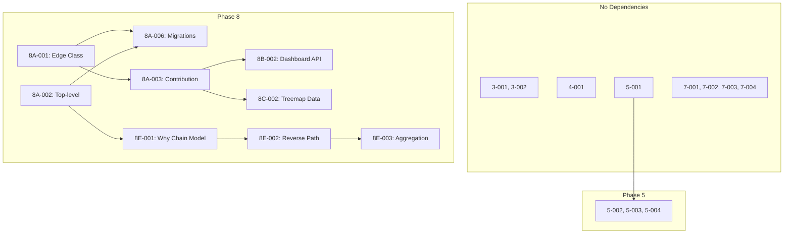

# Vizzy Implementation Tasks

## Directory Structure

```
vizzy-implementation/
├── PROJECT_STATUS.md          # Central tracking document (update this!)
└── tasks/
    ├── README.md              # This file
    ├── PHASE_3_COMPLETION.md  # Loop detection, redundant links
    ├── PHASE_4_COMPLETION.md  # Eager metadata fetching
    ├── PHASE_5_HOST_COMPARISON.md  # Host diff, comparison UI
    ├── PHASE_7_POLISH.md      # Pan/zoom, keyboard, performance
    └── PHASE_8_QUESTION_DRIVEN.md  # Question-driven viz (8A-8H tasks)
```

---

## Phase Overview

| Phase | Document | Status | Description |
|-------|----------|--------|-------------|
| 1 | N/A | ✅ COMPLETE | Foundation - DB, parser, FastAPI |
| 2 | N/A | ✅ COMPLETE | Core Viz - clusters, nodes, HTMX |
| 3 | `PHASE_3_COMPLETION.md` | 100% done | Search & Analysis |
| 4 | `PHASE_4_COMPLETION.md` | 100% done | NixOS Integration |
| 5 | `PHASE_5_HOST_COMPARISON.md` | Not started | Host Comparison |
| 6 | N/A (base) | ✅ COMPLETE | Additional Viz |
| 7 | `PHASE_7_POLISH.md` | Not started | Polish & UX |
| 8 | `PHASE_8_QUESTION_DRIVEN.md` | Not started | Question-Driven Viz |

---

## Task ID Conventions

Tasks use a hierarchical naming scheme:

```
{Phase}-{Section}-{Number}
```

Examples:
- `3-001` - Phase 3, Task 1 (Loop detection)
- `5-003` - Phase 5, Task 3 (Package trace comparison)
- `6A-001` - Phase 6 Extension, Section A, Task 1 (Edge classification)

### Phase 8 Sections

The Phase 8 (question-driven visualizations) is broken into sections:

| Section | Focus | Key Tasks |
|---------|-------|-----------|
| 8A | Data Model | Edge classification, top-level ID, contributions |
| 8B | Dashboard | System health metrics, overview |
| 8C | Treemap | Closure size visualization |
| 8D | Matrix | Variant comparison matrix |
| 8E | Why Chain | Attribution explorer |
| 8F | Enhanced Comparison | Extends Phase 5 |
| 8G | Visual Explorer | Graph improvements |
| 8H | UX Polish | Navigation, accessibility |

---

## How to Use These Documents

### For Project Managers

1. **Track progress** in `PROJECT_STATUS.md`
2. **Assign tasks** by updating the Assignee column
3. **Monitor blockers** using the Blocked By column
4. **Run standups** using the template at bottom of PROJECT_STATUS.md

### For Agents/Developers

1. **Pick a task** from PROJECT_STATUS.md that is NOT_STARTED and has no blockers
2. **Read the task document** for full implementation details
3. **Update PROJECT_STATUS.md** when you start (IN_PROGRESS)
4. **Follow the acceptance criteria** to know when you're done
5. **Update PROJECT_STATUS.md** when complete (COMPLETED)

### Task Document Structure

Each task in the phase documents includes:

```markdown
## Task {ID}: {Name}

### Objective
What this task accomplishes

### Context  
Why it matters, background info

### Input Files to Review
Existing code to understand

### Implementation Steps
1. Step-by-step instructions
2. With code examples
3. And file locations

### Acceptance Criteria
- [ ] Checkable criteria
- [ ] For completion

### Output Files to Create/Modify
- List of files to change
```

---

## Recommended Task Order

### Sprint 1: Complete Existing Phases
```
3-001 → 3-002 → 4-001
```
These can be done in parallel by different agents.

### Sprint 2: Host Comparison (Phase 5)
```
5-001 → 5-004 → 5-002 → 5-003
```
5-001 (full diff) is the foundation; others build on it.

### Sprint 3: Data Model (Phase 6A)
```
6A-001 → 6A-002 → 6A-006 → 6A-003
```
Edge classification and top-level ID are parallel; migrations need both.

### Sprint 4: Dashboard & Treemap (Phase 6B-C)
```
6B-001 → 6B-002 → 6B-003
6C-001 → 6C-002 → 6C-003
```
Dashboard and Treemap can be built in parallel.

### Sprint 5: Why Chain (Phase 6E)
```
6E-001 → 6E-002 → 6E-003 → 6E-005 → 6E-006
6E-004 can be done in parallel (UI design)
```

### Sprint 6: Polish (Phase 7)
```
7-001, 7-002, 7-003, 7-004 (all parallel)
```

---

## Dependency Quick Reference



---

## Files Modified Per Phase

### Phase 3 Completion
- `src/vizzy/services/analysis.py`
- `src/vizzy/routes/analyze.py`
- `src/vizzy/templates/analyze/cycles.html`
- `src/vizzy/templates/analyze/redundant.html`

### Phase 4 Completion
- `src/vizzy/services/nix.py`
- `src/vizzy/services/importer.py`

### Phase 5
- `src/vizzy/services/comparison.py` (new)
- `src/vizzy/routes/compare.py` (new)
- `src/vizzy/templates/compare.html` (new)
- `src/vizzy/templates/compare-select.html` (new)

### Phase 7
- `static/js/graph-navigation.js` (new)
- `static/js/keyboard.js` (new)
- `static/css/graph-controls.css` (new)
- `src/vizzy/services/cache.py` (new)
- `src/vizzy/middleware.py` (new)

### Phase 8
- `scripts/migrations/*.sql`
- `src/vizzy/services/dashboard.py` (new)
- `src/vizzy/services/treemap.py` (new)
- `src/vizzy/services/attribution.py` (new)
- `src/vizzy/templates/dashboard.html` (new)
- `src/vizzy/templates/treemap.html` (new)
- `src/vizzy/templates/why-chain.html` (new)
- `static/js/treemap.js` (new)


## Questions?

If task instructions are unclear:
1. Check the existing codebase for patterns
2. Review the PRD.md for context
3. Note questions in PROJECT_STATUS.md blockers section
